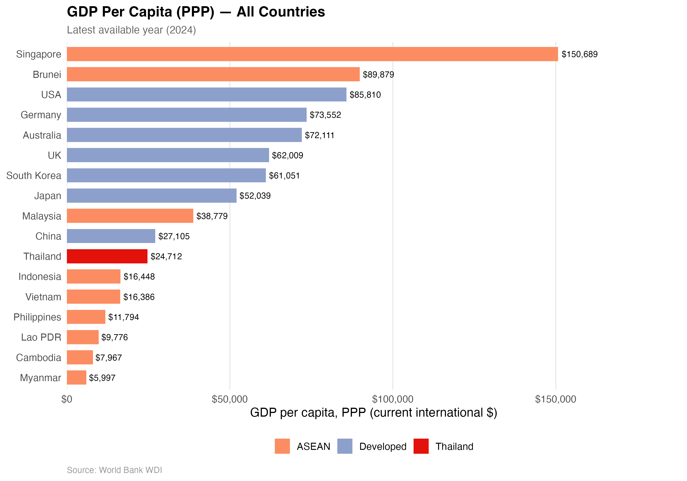
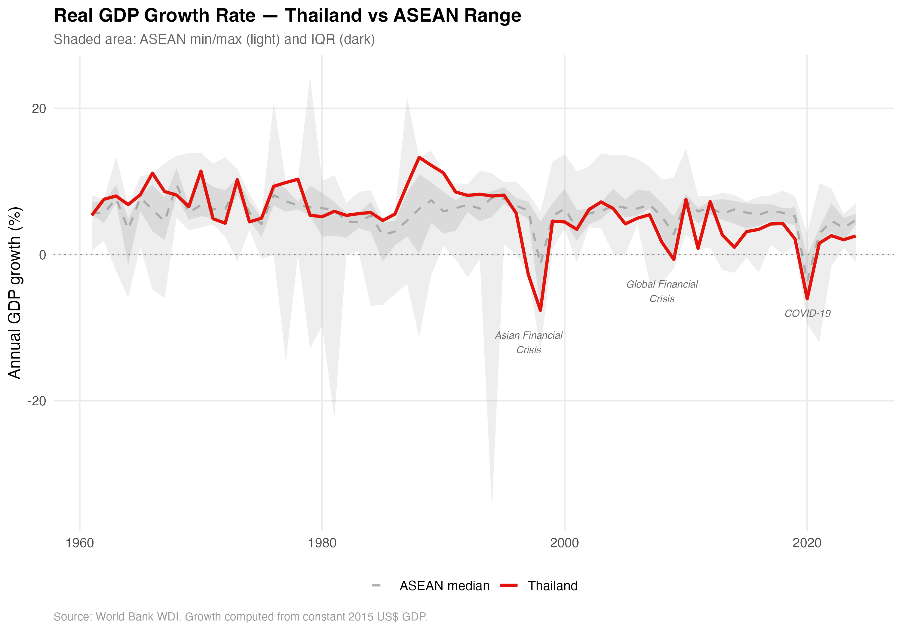
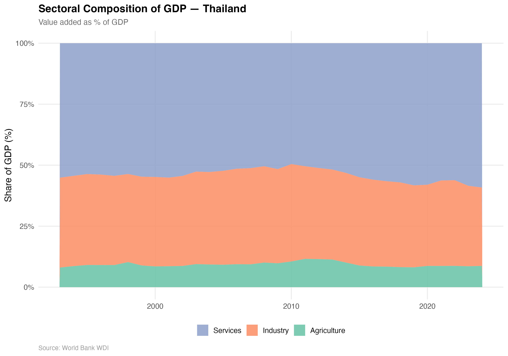
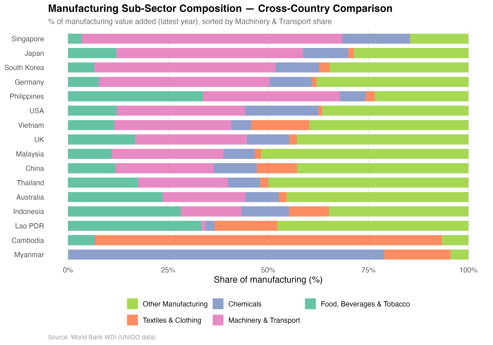
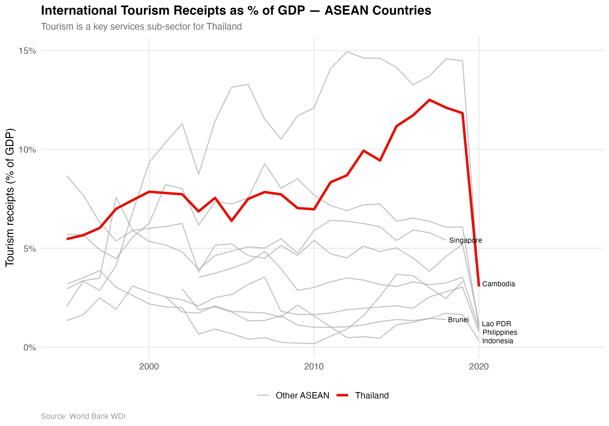
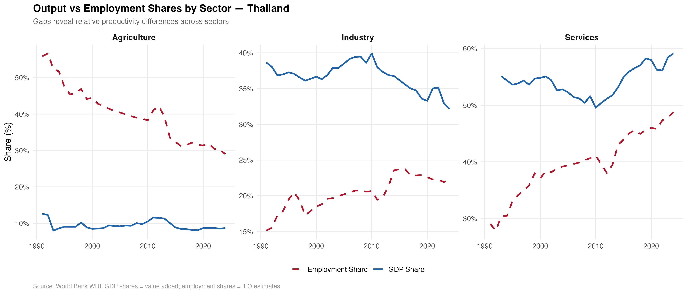
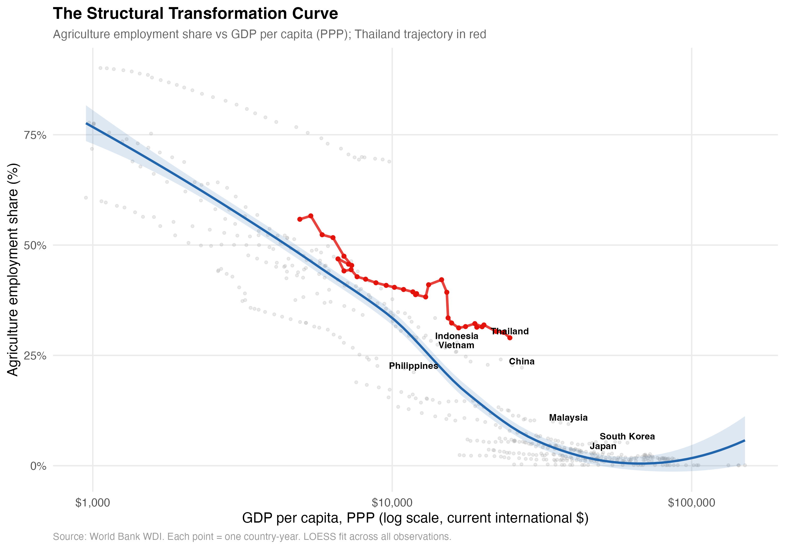
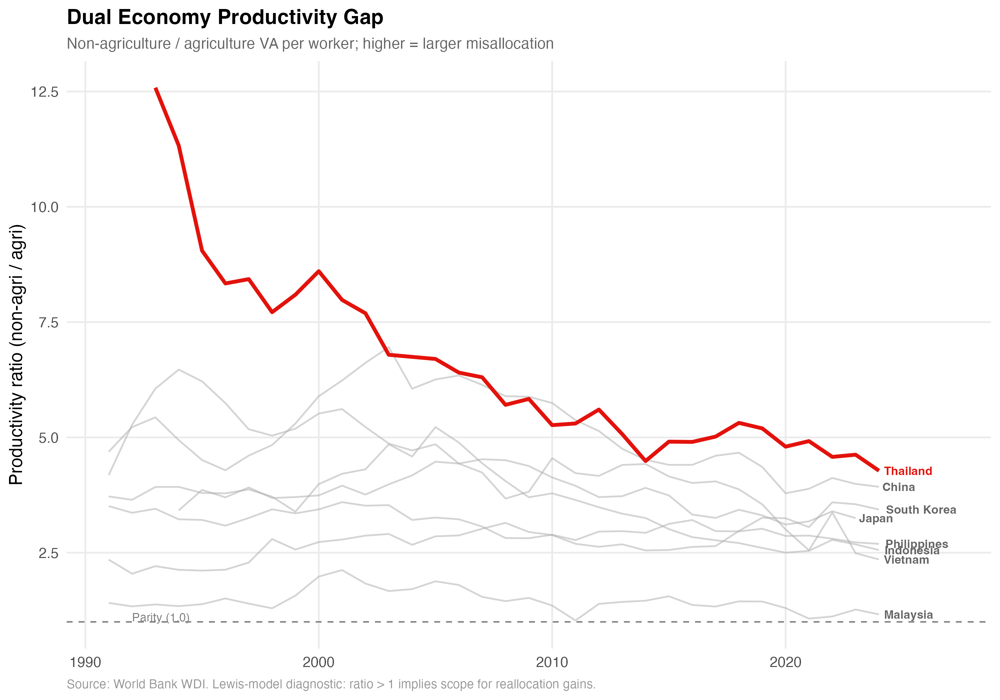
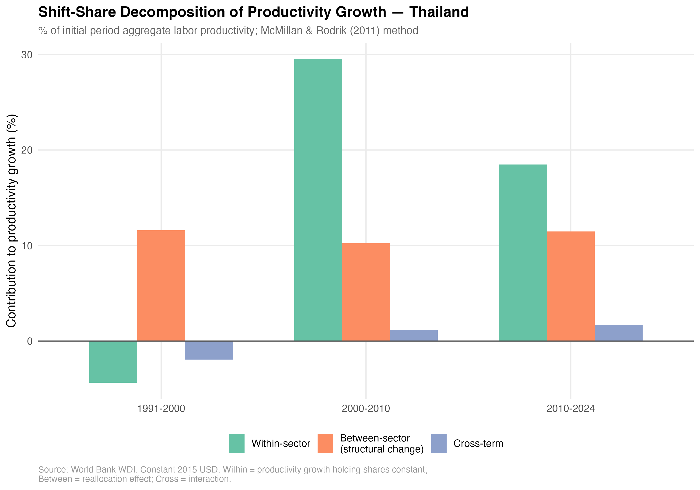

# Thailand Economy Analysis

Descriptive data analysis of the Thai economy using World Bank Development Indicators (WDI), comparing Thailand to ASEAN peers and developed economies worldwide.

## Overview

This project pulls macroeconomic data from the World Bank API and produces publication-quality visualizations covering:

- **GDP and GDP per capita** (nominal, constant 2015 USD, and PPP-adjusted)
- **Population** trends
- **Real GDP growth** rates
- **Sectoral composition** of GDP (agriculture, industry, services)
- **Manufacturing sub-sectors** (food/beverages/tobacco, textiles, chemicals, machinery/transport, medium/high-tech)
- **Agriculture** productivity and production indices (crops, livestock)
- **Tourism** receipts and dependence
- **Labor market** sectoral employment shares, gender breakdowns, labor force participation
- **Structural transformation** relative productivity, dual-economy gaps, shift-share decomposition

### Country Coverage

| Group | Countries |
|-------|-----------|
| **ASEAN (10)** | Thailand, Malaysia, Indonesia, Philippines, Vietnam, Singapore, Cambodia, Lao PDR, Myanmar, Brunei |
| **Developed (7)** | USA, Japan, Germany, UK, South Korea, Australia, China |

### Time Range

1960–2024 (varies by indicator; most have complete coverage from 1990 onward).

## Thailand at a Glance (2024)

| Indicator | Value |
|-----------|-------|
| GDP (current US$) | $526.5 billion |
| GDP per capita (current US$) | $7,347 |
| GDP per capita (PPP) | $24,712 |
| Population | 71.7 million |
| Agriculture share of GDP | 8.7% |
| Industry share of GDP | 32.1% |
| Services share of GDP | 59.2% |
| Real GDP growth | 2.5% |

## Selected Plots

### GDP Per Capita (PPP) — All Countries


### Real GDP Growth — Thailand vs ASEAN Range


### Sectoral Composition — Thailand Over Time


### Manufacturing Sub-Sectors — Cross-Country Comparison


### Tourism Receipts as % of GDP — ASEAN


### Output vs Employment Shares — Thailand


### The Structural Transformation Curve


### Dual Economy Productivity Gap


### Shift-Share Decomposition — Thailand


---

## Structural Transformation Analysis — Methodology

Script `06_structural_transformation.R` implements a suite of analyses drawn from the development economics literature on structural change. These methods quantify how labor and output shift across sectors (agriculture, industry, services) as economies develop, and diagnose productivity misallocation — a central concern in the "middle-income trap" debate around Thailand.

### Analysis 1: Output Shares vs Employment Shares

The simplest diagnostic of sectoral productivity differences compares each sector's share of GDP (value added) with its share of total employment. If a sector employs a large fraction of workers but produces a small fraction of output, its labor productivity is below average.

For Thailand in 2024, agriculture accounts for roughly 8.7% of GDP but 29% of employment — a gap that signals low agricultural labor productivity. Conversely, industry produces about 32% of GDP with only 22% of employment, implying above-average productivity.

This decomposition follows Kuznets (1966), who documented the systematic shift of labor from agriculture to industry and services as economies grow, with sectoral output shares adjusting at a different pace than employment shares.

### Analysis 2: Relative Labor Productivity

We compute labor productivity for each sector $i$ as value added per worker:

$$\pi_i = \frac{s_i \cdot Y}{\ \theta_i \cdot L}$$

where:

- $s_i$ = sector $i$'s share of GDP (value added)
- $Y$ = aggregate GDP (current USD)
- $\theta_i$ = sector $i$'s share of total employment
- $L$ = total labor force

We then index each sector's productivity relative to the economy-wide average:

$$\hat{\pi}_i = \frac{\pi_i}{\bar{\pi}} = \frac{\pi_i}{Y / L} = \frac{s_i}{\theta_i}$$

When $\hat{\pi}_i = 1$, the sector has average productivity. Values below 1 indicate the sector employs a disproportionately large share of workers relative to its output contribution; values above 1 indicate the opposite.

This measure, sometimes called the "comparative labor productivity" ratio, is widely used in the structural change literature (Timmer & de Vries, 2009; Herrendorf, Rogerson, & Valentinyi, 2014). For Thailand, agriculture's relative productivity ratio has been persistently around 0.3, meaning agricultural workers produce roughly one-third of the economy-wide average output per worker.

### Analysis 3: Structural Change Index (Michaely Index)

To measure the *pace* of labor reallocation across sectors over a given time interval, we use the **Michaely index** (Michaely, 1962; Dietrich, 2012):

$$MI = \frac{1}{2} \sum_{i=1}^{n} \left| \theta_{i,T} - \theta_{i,0} \right|$$

where $\theta_{i,t}$ is the employment share of sector $i$ at time $t$, and the sum runs over all $n$ sectors (agriculture, industry, services). The division by 2 normalizes the index so that $MI \in [0, 100]$: a value of 0 means no reallocation occurred, while higher values indicate faster structural change.

We compute this index by decade (1990s, 2000s, 2010s, 2020s) for Thailand and comparator countries. Thailand's Michaely index was highest in the 1990s (11.7 percentage points), reflecting rapid labor outflows from agriculture, and has decelerated since — consistent with the "middle-income trap" narrative of slowing structural transformation.

### Analysis 4: The Structural Transformation Curve

A foundational empirical regularity in development economics is the negative relationship between agriculture's employment share and GDP per capita. As countries grow richer, the fraction of workers in agriculture declines along a roughly log-linear curve (Chenery, 1960; Chenery & Taylor, 1968; Herrendorf et al., 2014).

We plot agriculture employment share ($\theta_{agri}$) against log GDP per capita (PPP) for all 17 countries across all available years, and fit a LOESS (locally estimated scatterplot smoothing) curve as a nonparametric benchmark. Thailand's trajectory is highlighted to show where it sits relative to the cross-country norm.

Countries that lie above the fitted curve have "too much" labor in agriculture relative to their income level (suggesting incomplete structural transformation), while those below have moved labor out of agriculture faster than the typical pattern would predict.

### Analysis 5: Dual Economy Productivity Gap

The **Lewis (1954) dual-economy model** posits that developing economies have a large pool of low-productivity agricultural labor that can be reallocated to higher-productivity modern sectors (industry and services), generating aggregate productivity gains without requiring within-sector technological improvement.

We measure the extent of this duality with the **productivity gap ratio**:

$$\rho = \frac{\pi_{non\text{-}agri}}{\pi_{agri}} = \frac{(s_{ind} + s_{svc}) \cdot Y \;/\; (\theta_{ind} + \theta_{svc}) \cdot L}{s_{agri} \cdot Y \;/\; \theta_{agri} \cdot L}$$

which simplifies to:

$$\rho = \frac{(s_{ind} + s_{svc}) \;/\; (\theta_{ind} + \theta_{svc})}{s_{agri} \;/\; \theta_{agri}}$$

When $\rho = 1$, agricultural and non-agricultural workers are equally productive and there are no gains from reallocation. Values of $\rho \gg 1$ indicate large productivity differentials — i.e., moving a worker from agriculture to industry or services would raise aggregate output.

Gollin, Lagakos, and Waugh (2014) document that this ratio ranges from near 1 in rich countries to over 5 in the poorest, after adjusting for differences in hours worked and human capital. Thailand's ratio has declined from approximately 12 in 1991 to 4.3 in 2024 — still substantial, and higher than most comparators at similar income levels, suggesting continued scope for Lewis-type reallocation gains.

### Analysis 6: Shift-Share Decomposition (McMillan & Rodrik, 2011)

Aggregate labor productivity growth can be decomposed into contributions from (a) productivity growth *within* each sector and (b) the *reallocation* of labor *between* sectors. We implement the three-term shift-share decomposition following McMillan and Rodrik (2011):

Define aggregate labor productivity as:

$$\Pi_t = \frac{Y_t}{L_t} = \sum_{i=1}^{n} \theta_{i,t} \cdot \pi_{i,t}$$

where $\theta_{i,t}$ is the employment share and $\pi_{i,t}$ is the labor productivity of sector $i$ at time $t$. The change in aggregate productivity between period $0$ and period $T$ decomposes as:

$$\Delta \Pi = \underbrace{\sum_{i} \theta_{i,0} \cdot \Delta\pi_i}_{\text{Within-sector effect}} + \underbrace{\sum_{i} \pi_{i,T} \cdot \Delta\theta_i}_{\text{Between-sector (structural change) effect}} + \underbrace{\sum_{i} \Delta\pi_i \cdot \Delta\theta_i}_{\text{Cross-term}}$$

where $\Delta\pi_i = \pi_{i,T} - \pi_{i,0}$ and $\Delta\theta_i = \theta_{i,T} - \theta_{i,0}$.

- The **within-sector effect** captures productivity gains that would have occurred if each sector's employment share had remained constant at its initial level. This reflects technology adoption, capital deepening, and efficiency improvements within sectors.
- The **between-sector (structural change) effect** captures the contribution of labor reallocation to aggregate productivity. It is positive when workers move toward sectors with higher *terminal-period* productivity levels — the classic source of gains from structural transformation.
- The **cross-term** is an interaction effect that is positive when sectors experiencing productivity growth also attract more workers.

All terms are expressed as a percentage of initial-period aggregate labor productivity ($\Pi_0$) and computed using constant 2015 USD to remove price-level effects.

For Thailand over 1991–2024, the decomposition shows substantial contributions from both within-sector improvement (+51%) and between-sector reallocation (+44%), with a small positive cross-term (+3%). The negative within-sector effect during 1991–2000 reflects the 1997 Asian Financial Crisis. From 2000 onward, within-sector productivity growth dominates, though the between-sector effect remains sizable — indicating that Thailand continues to benefit from ongoing labor reallocation out of agriculture.

### References

- Chenery, H. B. (1960). Patterns of industrial growth. *American Economic Review*, 50(4), 624–654.
- Chenery, H. B., & Taylor, L. (1968). Development patterns: Among countries and over time. *Review of Economics and Statistics*, 50(4), 391–416.
- Dietrich, A. (2012). Does growth cause structural change, or is it the other way around? A dynamic panel data analysis for seven OECD countries. *Empirical Economics*, 43(3), 915–944.
- Gollin, D., Lagakos, D., & Waugh, M. E. (2014). The agricultural productivity gap. *Quarterly Journal of Economics*, 129(2), 939–993.
- Herrendorf, B., Rogerson, R., & Valentinyi, Á. (2014). Growth and structural transformation. In *Handbook of Economic Growth* (Vol. 2, pp. 855–941). Elsevier.
- Kuznets, S. (1966). *Modern Economic Growth: Rate, Structure, and Spread*. Yale University Press.
- Lewis, W. A. (1954). Economic development with unlimited supplies of labour. *Manchester School*, 22(2), 139–191.
- McMillan, M. S., & Rodrik, D. (2011). Globalization, structural change and productivity growth. *NBER Working Paper No. 17143*. (Published in: McMillan, M., Rodrik, D., & Verduzco-Gallo, Í. (2014). Globalization, structural change, and productivity growth, with an update on Africa. *World Development*, 63, 11–32.)
- Michaely, M. (1962). *Concentration in International Trade*. North-Holland.
- Timmer, M. P., & de Vries, G. J. (2009). Structural change and growth accelerations in Asia and Latin America: A new sectoral data set. *Cliometrica*, 3(2), 165–190.

---

## Repository Structure

```
Thailand_Economy_Analysis/
├── 01_pull_data.R                        # Pull core WDI data (GDP, population, sectoral)
├── 02_descriptive_plots.R                # 8 plots: GDP, growth, population, sectors
├── 03_manufacturing_subsectors.R         # 6 plots: manufacturing sub-sector breakdown
├── 04_services_agriculture_subsectors.R  # 7 plots: agriculture, tourism
├── 05_labor_by_sector.R                  # 13 plots: sectoral employment, gender, LFP
├── 06_structural_transformation.R        # 8 plots: structural change, shift-share decomp.
├── data/
│   ├── wb_full_panel.csv                 # Full panel (17 countries × 65 years × 13 indicators)
│   ├── wb_thailand_detail.csv            # Thailand-only subset
│   ├── wb_sectoral.csv                   # Sectoral composition (long format)
│   ├── wb_manufacturing_subsectors.csv   # Manufacturing sub-sectors (wide)
│   ├── wb_manufacturing_subsectors_long.csv # Manufacturing sub-sectors (long)
│   ├── wb_agri_services_subsectors.csv   # Agriculture & tourism indicators
│   ├── wb_labor_by_sector.csv            # Sectoral employment & labor force by gender
│   └── structural_transformation.csv     # Computed productivity & structural change metrics
├── plots/                                # 42 PNG figures (300 DPI)
└── README.md
```

## Data Sources

All data is pulled programmatically from the [World Bank Open Data](https://data.worldbank.org/) API via the [`WDI`](https://cran.r-project.org/package=WDI) R package.

| Category | WDI Indicator Codes |
|----------|-------------------|
| GDP (current US$) | `NY.GDP.MKTP.CD` |
| GDP (constant 2015 US$) | `NY.GDP.MKTP.KD` |
| GDP per capita (current US$) | `NY.GDP.PCAP.CD` |
| GDP per capita (constant 2015 US$) | `NY.GDP.PCAP.KD` |
| GDP, PPP (current intl $) | `NY.GDP.MKTP.PP.CD` |
| GDP per capita, PPP | `NY.GDP.PCAP.PP.CD` |
| Population | `SP.POP.TOTL` |
| Agriculture (% of GDP) | `NV.AGR.TOTL.ZS` |
| Industry (% of GDP) | `NV.IND.TOTL.ZS` |
| Services (% of GDP) | `NV.SRV.TOTL.ZS` |
| Manufacturing (% of GDP) | `NV.IND.MANF.ZS` |
| Food/bev/tobacco (% of mfg) | `NV.MNF.FBTO.ZS.UN` |
| Textiles/clothing (% of mfg) | `NV.MNF.TXTL.ZS.UN` |
| Chemicals (% of mfg) | `NV.MNF.CHEM.ZS.UN` |
| Machinery/transport (% of mfg) | `NV.MNF.MTRN.ZS.UN` |
| Med/high-tech mfg (% of mfg) | `NV.MNF.TECH.ZS.UN` |
| Crop production index | `AG.PRD.CROP.XD` |
| Livestock production index | `AG.PRD.LVSK.XD` |
| Agri value added per worker | `NV.AGR.EMPL.KD` |
| Tourism receipts (US$) | `ST.INT.RCPT.CD` |
| Tourism (% of exports) | `ST.INT.RCPT.XP.ZS` |
| Employment in agriculture (%) | `SL.AGR.EMPL.ZS` |
| Employment in industry (%) | `SL.IND.EMPL.ZS` |
| Employment in services (%) | `SL.SRV.EMPL.ZS` |
| Labor force, total | `SL.TLF.TOTL.IN` |
| Labor force participation rate (%) | `SL.TLF.CACT.ZS` |

Manufacturing sub-sector data is originally sourced from [UNIDO](https://stat.unido.org/) and distributed through WDI. Employment share data is sourced from [ILO](https://www.ilo.org/) modeled estimates, distributed through WDI.

## Requirements

- **R** (tested with R 4.x)
- **CRAN packages**: `WDI`, `tidyverse`, `scales`

Packages are installed automatically if missing when running any script.

## Usage

Run scripts in order:

```r
source("01_pull_data.R")                       # ~30 seconds (API calls)
source("02_descriptive_plots.R")               # ~10 seconds
source("03_manufacturing_subsectors.R")        # ~15 seconds
source("04_services_agriculture_subsectors.R") # ~15 seconds
source("05_labor_by_sector.R")                 # ~20 seconds (API calls)
source("06_structural_transformation.R")       # ~10 seconds (reads saved CSVs)
```

Or from the command line:

```bash
Rscript 01_pull_data.R
Rscript 02_descriptive_plots.R
Rscript 03_manufacturing_subsectors.R
Rscript 04_services_agriculture_subsectors.R
Rscript 05_labor_by_sector.R
Rscript 06_structural_transformation.R
```

## Notes

- **Services sub-sector granularity**: The WDI API no longer serves detailed services sub-sector breakdowns (finance, trade, transport). For that level of detail, [UNIDO INDSTAT](https://stat.unido.org/) data must be downloaded manually.
- **Tourism data**: Coverage ends at 2020 due to WDI reporting lags and the COVID-19 disruption.
- **Growth rates**: Computed from constant 2015 US$ GDP rather than pulled directly, to avoid API timeout issues with the pre-computed WDI growth indicators.

## License

Data is sourced from the World Bank under the [Creative Commons Attribution 4.0 International License (CC BY 4.0)](https://creativecommons.org/licenses/by/4.0/).
